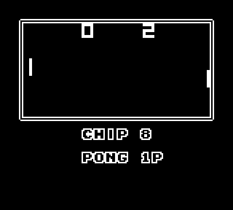
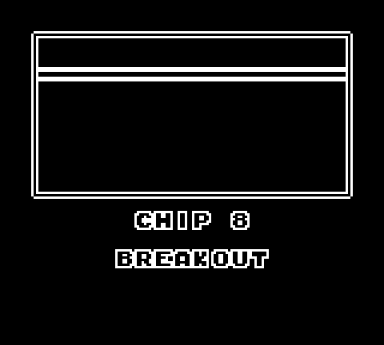

# GB-8

## What's this?

GB-8 is a CHIP-8 interpreter for the Gameboy Color. It comes pre-loaded with a whole bunch of CHIP-8 ROMs and is easily expandable and modular. And thanks to the small size of CHIP-8 ROMs, it even fits onto a 32KB cartridge!

## How do I use it?

Simply download the newest version from the [Releases Section](https://github.com/Hacktix/GB-8/releases) and load it up on hardware or on your favorite Gameboy emulator. You'll be shown a menu which you can navigate using the D-Pad. Once you've selected the game you want to play, press A or Start in order to start the emulator. If you want to quit out of the game, pressing the buttons A, B, Start and Select all at the same time exits the emulator.

Controls for the games themselves are mapped on a per-game basis, most should be quite intuitive though.

## What does it look like?

Except for the menu parts of the emulator, it's simply just a common CHIP-8 display. For convenience, the emulator scales the screen up by a factor of 2, so that things are visible without having to squint at them.

But it's probably best to see for yourself:

